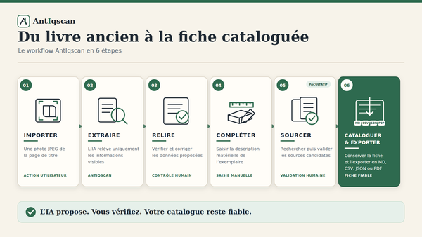
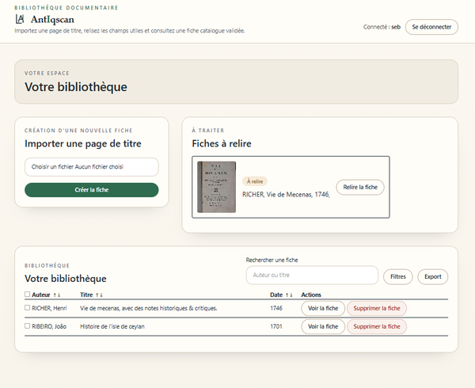
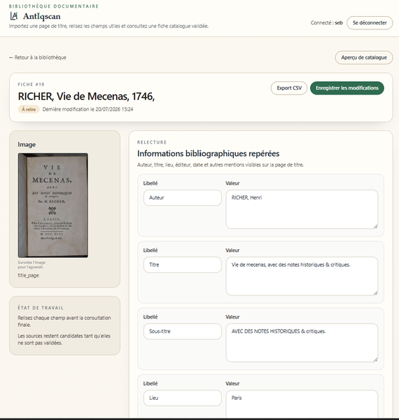
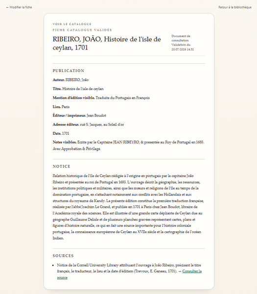

# AntIqscan

Application Laravel/MySQL pour créer des fiches de catalogue de librairie ancienne à partir d’une photographie de page de titre.

**Démonstration :** [antiqscan.vatinel.fr](https://antiqscan.vatinel.fr)

## Aperçu

### Workflow fonctionnel



### Bibliothèque et création d’une fiche



### Relecture des données extraites



### Fiche catalogue validée et sourcée



## Principes V1

- Une seule image à l’upload : page de titre.
- Schéma compatible multi-image futur via `book_images`.
- Extraction IA stricte : uniquement ce qui est visible sur l’image.
- Aucun enrichissement automatique avant validation utilisateur.
- Champs physiques saisis manuellement.
- Références et estimation prix optionnelles, sourcées, éditables, refusées si sources insuffisantes.
- Priorité : fiabilité > coût API > éditabilité > fiche sobre.

## Stack

Laravel 12, MySQL/MariaDB, Blade/Tailwind/Alpine, queues Laravel, stockage local, Caddy.

## Installation locale

```bash
composer install
cp .env.example .env
php artisan key:generate
php artisan migrate
npm install
npm run build
php artisan serve
```

## Pipeline cible

1. Upload page de titre.
2. Optimisation image locale.
3. Extraction IA vision économique, visible-sur-image uniquement.
4. Validation JSON locale.
5. Affichage champs + origine + confiance.
6. Correction/validation utilisateur.
7. Saisie manuelle des champs physiques.
8. Enrichissement documentaire optionnel.
9. Estimation prix optionnelle.
10. Génération fiche catalogue libraire.
11. Export Markdown/CSV/JSON/PDF.
